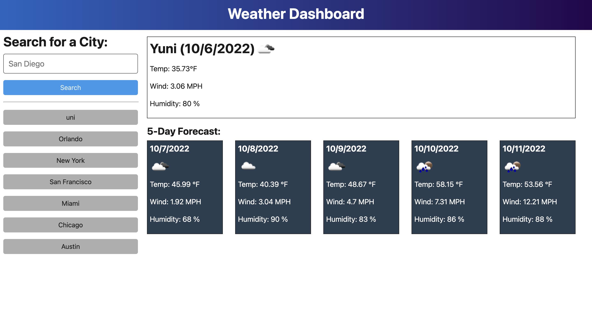

# API Weather Forecast Website

## Why is this Here?
This website was a homework challenge given to me by the Coding Bootcamp offered at University of Texas - Austin.
I was given a mockup website and asked to recreate it from scratch with User Stories in mind.

[Test it out here](https://opaleone.github.io/API-Weather-Forecast-/)

>This was the website I was asked to recreate

>My Finished Product

## How It Works

I was tasked with creating a website that, using an API called OpenWeatherAPI, would find out weather information for a given city and return that information to the user. There were three main parts to this website.

    Set up HTML to recieve information
    Request Information from OpenWeather API
    Display information on the page

### HTML/CSS
The first thing that I worked on was creating the sections to feed information into. All I did in my index was create sections that I could later insert and append information into whenever I received a response from the API.

### API Request
This step took me some time to figure out.

First, I took the time to read through the documentation on OpenWeather's API. I had to find the correct URLs to request from and understand which queries I would need to finish the website. This took a lot of trial and error THROUGHOUT the project from start to finish. 

What I settled with was sending out a first request to derive the latitude and longitude from a plain city name using OpenWeather's GeoLocator API. After I received the lat long from the city name, I could then feed those in as queries within the One Call API. This would respond with lot's of weather information on this point. 

So, I, then, experimented with Object Traversal to dig into the response object and find only the relevant information I was looking for such as, Temperature, Wind Speeds, etc. Once I figured out how to access this information, I pushed it all to global object variables for later recollection. 

### Weather Display

With the information in hand, I proceeded to display the information on the page.

I did this by using the sections I had created earlier on the HTML file. I would create the card elements and everything within them. Then I would set the textContent of each element equal to the corresponding object key and append the cards to the 5 day Forecast section.

Another thing I worked to achieve, was displaying the buttons of past searches for recollection later. First, I store every search input given by the user within local storage in an array. Then, I simply create and append a button to the search sidebar for each city name that is stored within the local storage. Also, everytime you refresh the page, it runs this for loop again to create these buttons even if you close and reopen the page.

    Quick tip:
      To clear your local storage, You can clear out all the cache and cookies with your browser settings. 
      This will clear out any local storage that was created by any website.

            Warning!!
                This will also clear any saved login information from other websites as well!!!
                Use at your discretion!!

## Credits

University of Texas - Austin

[OpenWeatherAPI](https://openweathermap.org/api)

[Stackoverflow.com](https://stackoverflow.com)

## License
MIT License - For any questions, please refer to LICENSE in repository.